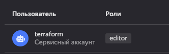
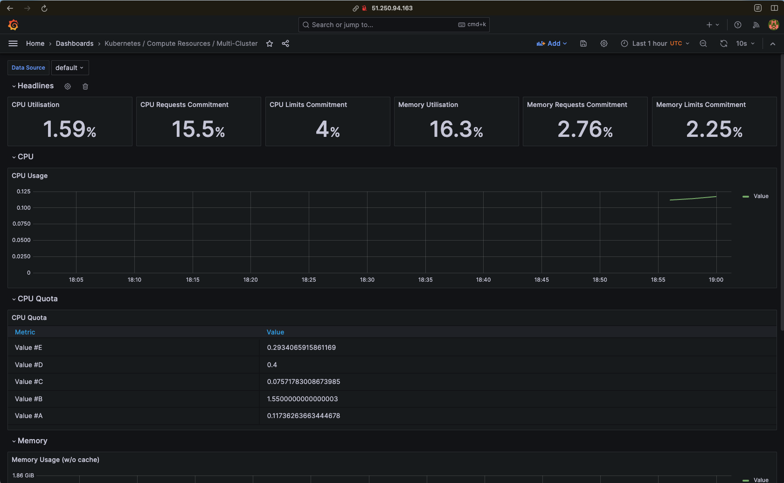
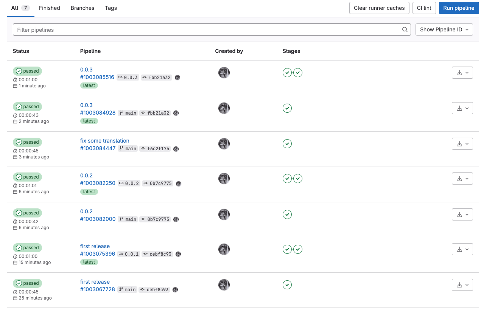
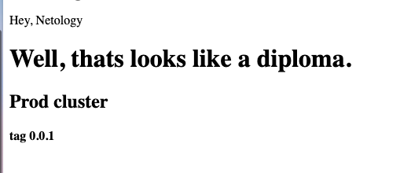
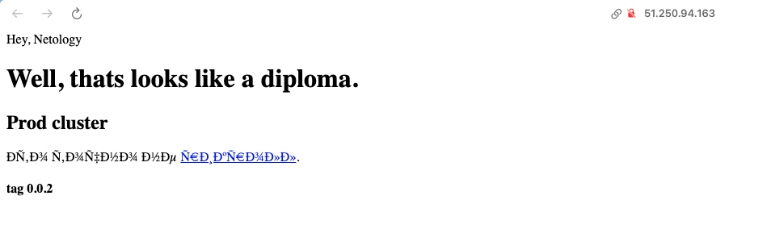
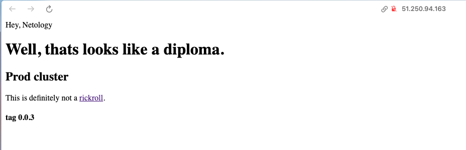
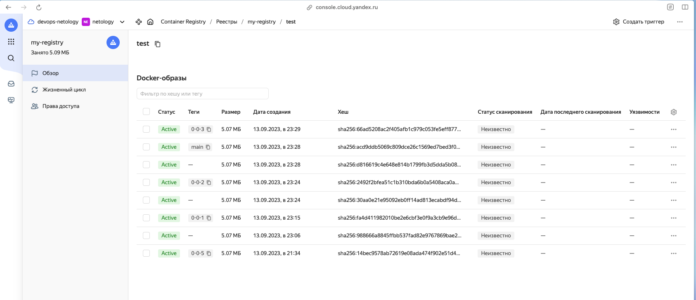
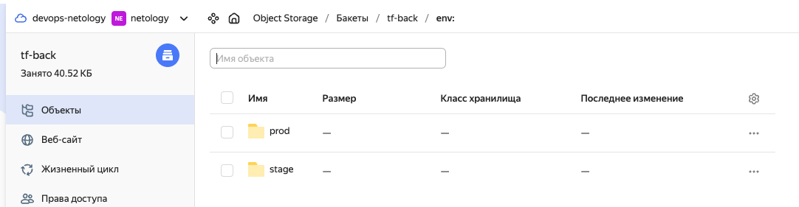
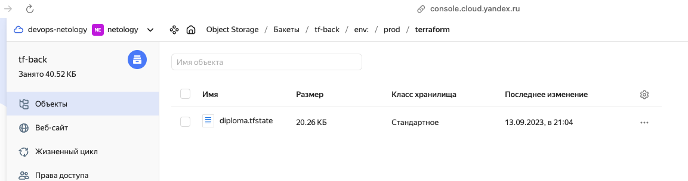

# Диплом
  * [Цели:](#цели)
  * [Этапы выполнения:](#этапы-выполнения)
     * [Создание облачной инфраструктуры](#создание-облачной-инфраструктуры)
     * [Создание Kubernetes кластера](#создание-kubernetes-кластера)
     * [Создание тестового приложения](#создание-тестового-приложения)
     * [Подготовка cистемы мониторинга и деплой приложения](#подготовка-cистемы-мониторинга-и-деплой-приложения)
     * [Установка и настройка CI/CD](#установка-и-настройка-cicd)
  * [Итог](#итог)

---
## Цели

1. Подготовить облачную инфраструктуру на базе облачного провайдера Яндекс.Облако.
2. Запустить и сконфигурировать Kubernetes кластер.
3. Установить и настроить систему мониторинга.
4. Настроить и автоматизировать сборку тестового приложения с использованием Docker-контейнеров.
5. Настроить CI для автоматической сборки и тестирования.
6. Настроить CD для автоматического развёртывания приложения.

---
## Этапы выполнения

### Создание облачной инфраструктуры

1. Сервисный аккаунт создан в соответствии с требованиями яндекса, в роли `editor`:
   <details>
     <summary>Скрин</summary>

     
   </details>
2. Бэкенд выбрал альтернативным (S3 bucket внутри ЯО), так как не хотелось лезть в `tf cloud`, да и по опыту многие компании проедпочитают on permise решения внутри инфраструктуры. Конфиги в директории [tf-backend](src/tf-backend).
3. Workspaces:
   <details>
     <summary>Terminal output</summary>

     ```
     ➜ tf workspace list
       default
       prod
     * stage     
     ```
   </details>
4. VPC лежат в трёх доступных регионах, конфиги в директории [tf](src/tf).
5. `terraform destroy` и `terraform apply` выполняются без проблем (с поправкой на то, что под окружения у меня создаются разные каталоги в облаке и их удаление занимает время).

### Создание Kubernetes кластера

~~Как говорил один извесный в кругах русскоязычного kubernetes-комьюнити товарищ - `kubespray - го****а`, поэтому его не использовал.~~ 

Тут слегка интересный способ реализации - через `kubeadm` + `ansible`. `Terraform` создаёт `inventory` для `ansible`, а тот в свою очередь настраивает почти всё необходимое - остаётся только поправить сертификаты под `nat ip` (для доступа не через локальные адреса) и добавить ноды в кластер через `kubeadm join` - и кластер + `cni` в виде `Weawe net`(не спрашивайте почему именно он) готов.

Можно было бы автоматизировать и `join`, но это слегка проблематично и в этом нет необходимости.

`kubectl get pods -A`:
  <details>
    <summary>Terminal output</summary>

    ```
    root@master-01:~# kubectl get pods -A
    NAMESPACE     NAME                                READY   STATUS    RESTARTS        AGE
    kube-system   coredns-5dd5756b68-85hnn            1/1     Running   0               6m50s
    kube-system   coredns-5dd5756b68-97k8d            1/1     Running   0               6m50s
    kube-system   etcd-master-01                      1/1     Running   0               7m2s
    kube-system   kube-apiserver-master-01            1/1     Running   0               7m2s
    kube-system   kube-controller-manager-master-01   1/1     Running   0               7m2s
    kube-system   kube-proxy-556s8                    1/1     Running   0               32s
    kube-system   kube-proxy-vbjbl                    1/1     Running   0               6m50s
    kube-system   kube-proxy-vwqzj                    1/1     Running   0               33s
    kube-system   kube-scheduler-master-01            1/1     Running   0               7m2s
    kube-system   weave-net-kfqfg                     2/2     Running   1 (4m42s ago)   4m58s
    kube-system   weave-net-qvtpn                     2/2     Running   0               32s
    kube-system   weave-net-tn8sc                     2/2     Running   0               33s  
    ```
  </details>

### Создание тестового приложения

Максимально простой путь, максимально простой способ: [Dockerfile](src/test-app/Dockerfile), собирает nginx и прокидывает в него статику, всё лежит в [test-app](src/test-app).

А, да, registry. Поднят в YCR через tf, конфиги в [tf-container-registry](src/tf-container-registry).

### Подготовка cистемы мониторинга и деплой приложения

Воспользовался easy-way, ибо ну очень лениво в рамках диплома поднимать `qbec + altantis`, поэтому helm-чарты + деплойменты наше всё.

  <details>
    <summary>Детали установки стека мониторинга:</summary>

    ```bash
    # Создаём отдельный ns для монитоинга
    kubectl create namespace monitoring 
    # Добавляем helm-репо для установки мониторинга
    helm repo add prometheus-community https://prometheus-community.github.io/helm-charts
    # Устанавливаем стек
    helm install stable prometheus-community/kube-prometheus-stack --namespace=monitoring
    #
    # Для доступа из сети можно пойти двумя путями - я вырбал простой и отредактировал сервисы, добавив туда nodePort
    #
    kubectl edit svc stable-kube-prometheus-sta-prometheus
    kubectl edit svc stable-grafana
    # Проверяем работу
    kubectl get pods
    NAME                                                     READY   STATUS    RESTARTS   AGE
    alertmanager-stable-kube-prometheus-sta-alertmanager-0   2/2     Running   0          2m55s
    prometheus-stable-kube-prometheus-sta-prometheus-0       2/2     Running   0          2m55s
    stable-grafana-58d569ffb9-svl8x                          3/3     Running   0          3m7s
    stable-kube-prometheus-sta-operator-8599dfcf9-m6cbv      1/1     Running   0          3m7s
    stable-kube-state-metrics-fc6fd8c55-mxdgt                1/1     Running   0          3m7s
    stable-prometheus-node-exporter-9np8h                    1/1     Running   0          3m7s
    stable-prometheus-node-exporter-sxq8f                    1/1     Running   0          3m7s
    stable-prometheus-node-exporter-vtgnv                    1/1     Running   0          3m7s
    ```
  </details>


Креды от `grafana` admin/prom-operator.
<details>
  <summary>Скрин с графаны:</summary>

  
</details>

Но, есть нюанс, для доступа ко всем метрикам необходимо реконфигурировать авторизацию внутри кластера - что не совсем good, поэтому метрики собираются не все.

### Установка и настройка CI/CD

Реализовано, как и запрошено, на `Gitlab CI/CD` и public-раннерах.

Сам [.gitlab-ci.yml](.gitlab-ci.yml)

<details>
  <summary>Примеры пайплайнов и пара тестовых деплоев + скрин с registry</summary>

  
  
  
  
  
  
  
  
  
</details>

## Итог

1. Конфиги tf хранятся в [tf-backend](src/tf-backend), [tf](src/tf) и [tf-container-registry](src/tf-container-registry) соответственно.
2. State-файлы tf для основных окружений хранятся в s3-bucket:
   <details>
     <summary>Скрины</summary>

     

     
   </details>
3. Playbook c примерами inventory ансибла лежит в [ansible](src/ansible)
4. [Dockerfile](src/test-app/Dockerfile) - registry закрытый, но, если надо, пулану в DockerHub
5. Что подразумевается под конфигурацией k8s? Если речь о конфиге для подключения - предоставлю по запросу.
6. [TestApp](http://51.250.94.163:30080/), [Grafana](http://51.250.94.163:30002/dashboards) - креды admin/prom-operator.
7. Я понимаю, что не совсем корректно хранить всё в одном репо, но, в рамках дипломной работы считаю, что это допускается.